# Google Container Engine ”Essential”

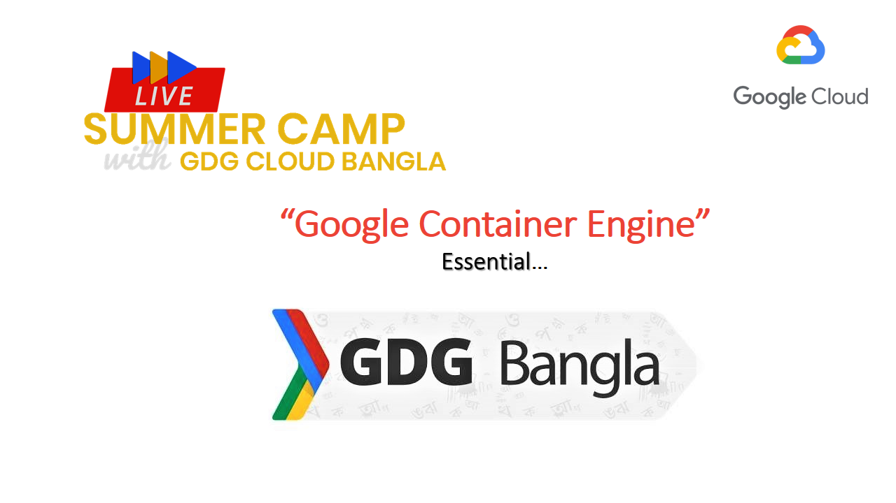

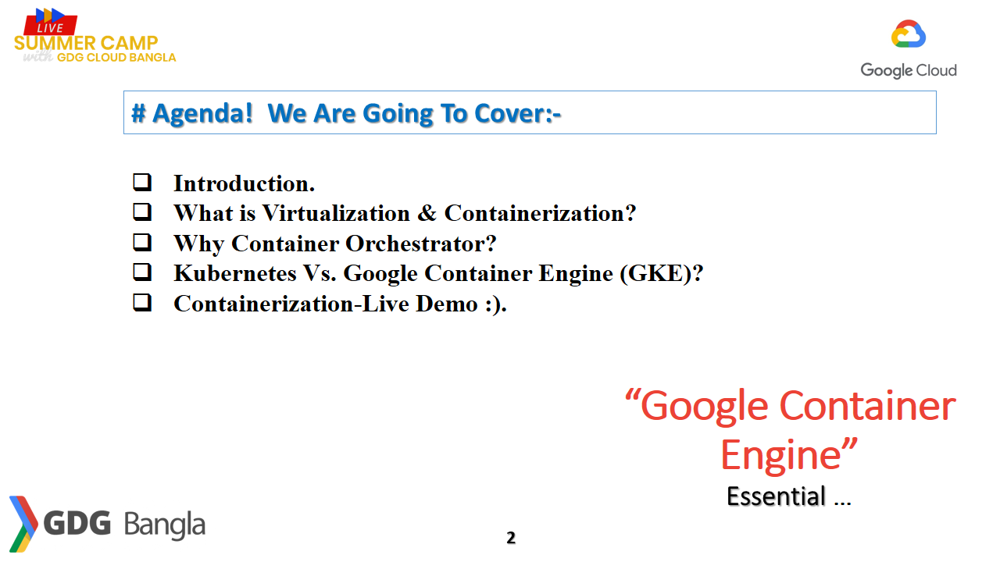

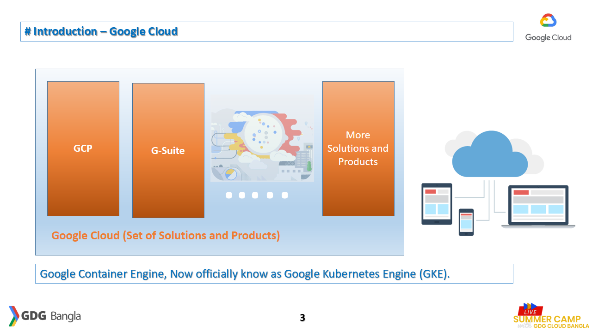

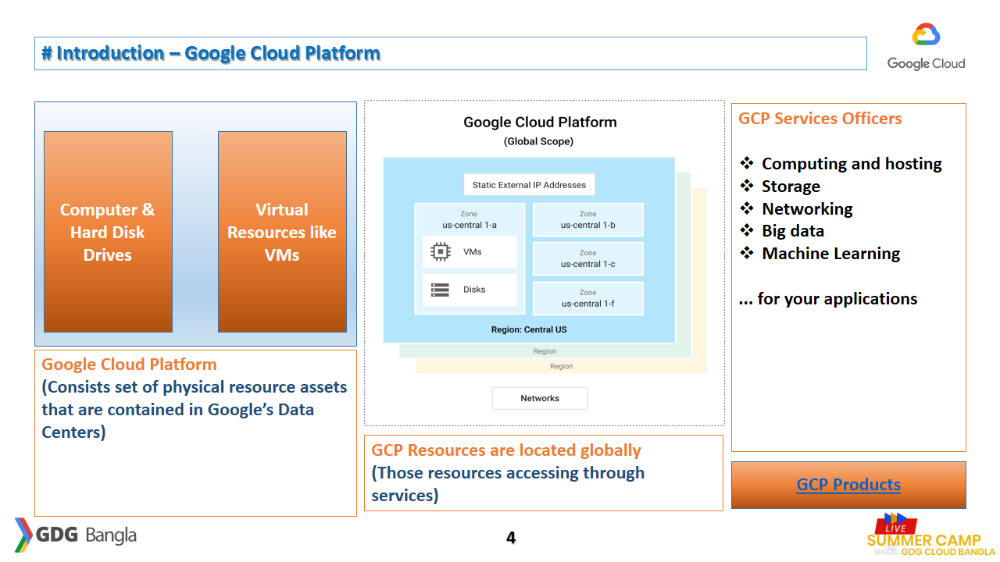

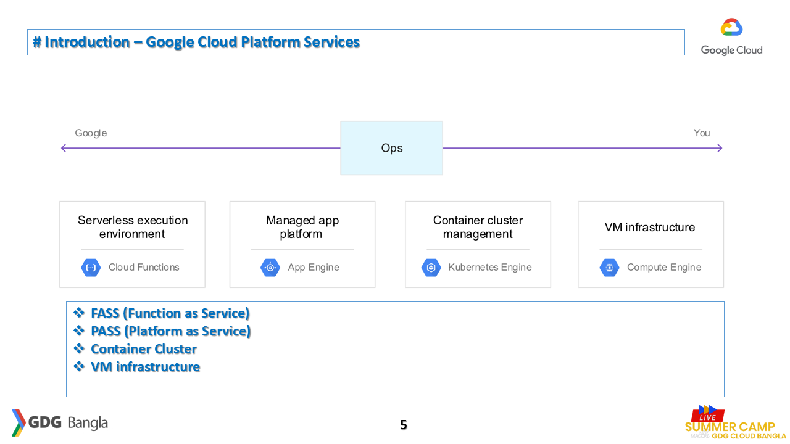

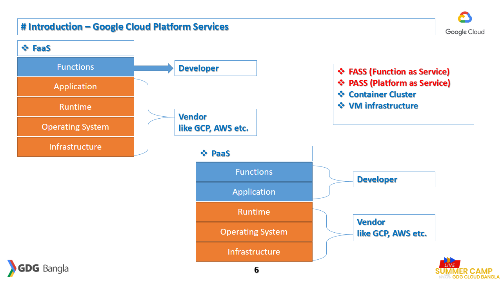

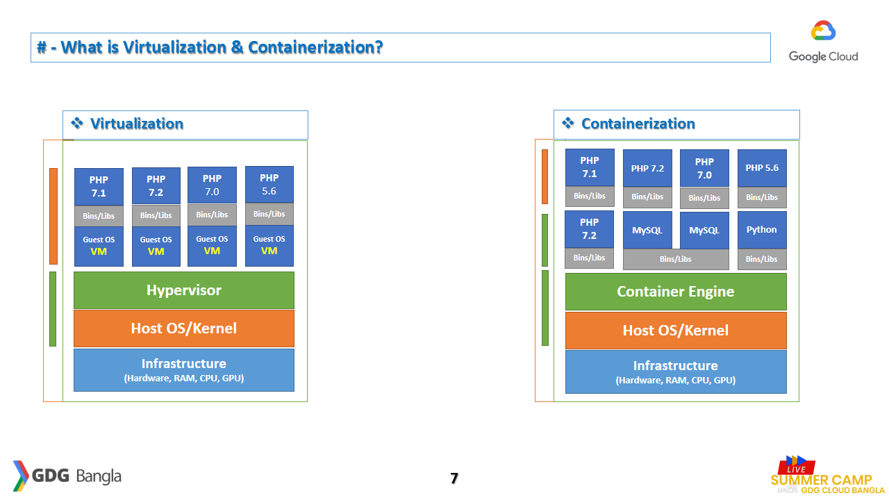

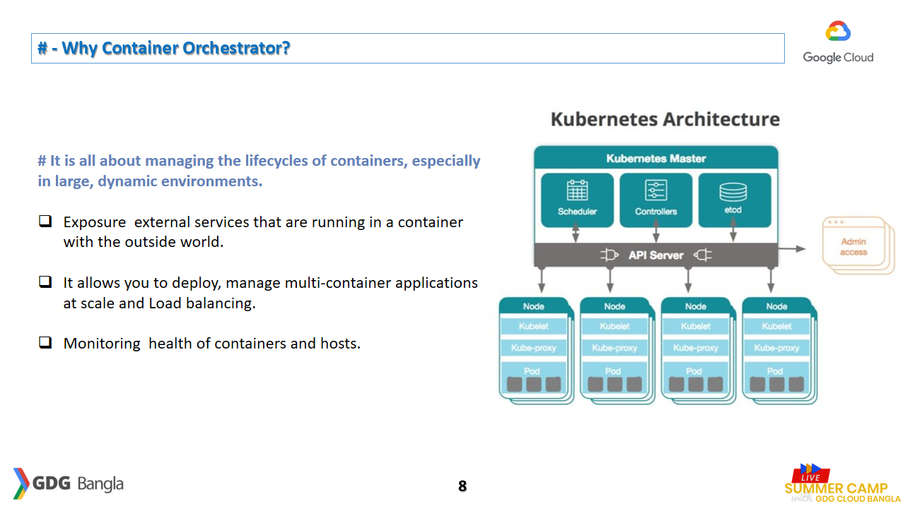

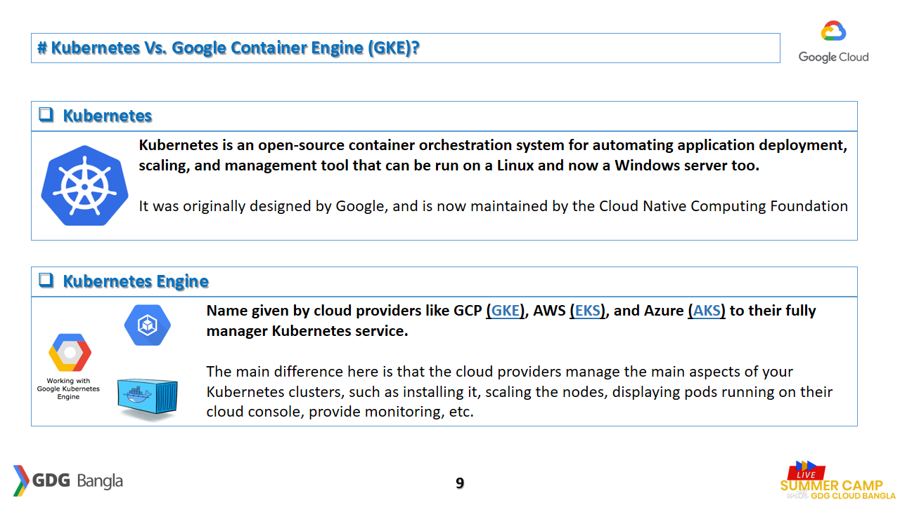

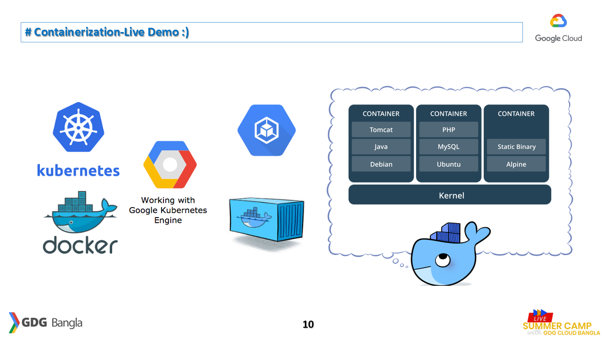

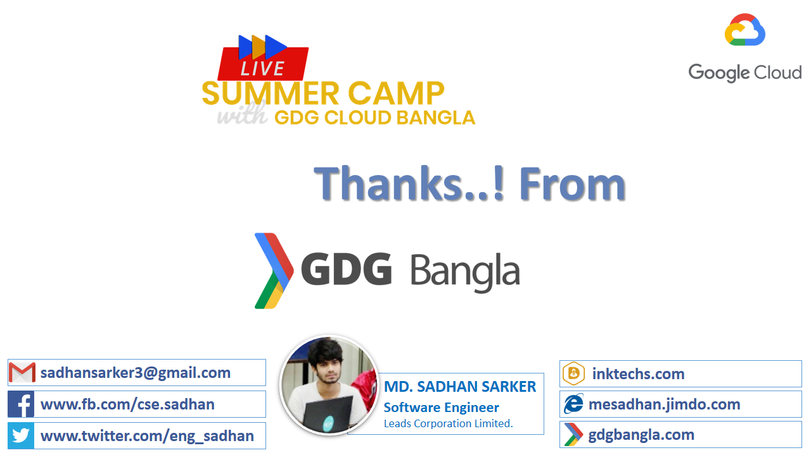

## References:
- [Google Cloud Overview](https://cloud.google.com/docs/overview)
- [Products](https://cloud.google.com/products)
- [Cloud-platform-services](https://cloud.google.com/docs/overview/cloud-platform-services)
- [Kubernetes-basics](https://kubernetes.io/docs/tutorials/kubernetes-basics)
- [Docker Download](https://www.docker.com/products/docker-desktop)
- [Docker Hub](https://cloud.docker.com)
 

#  Run and Test Live Demo Application

- [ ] First Install Docker Application.
- [ ] Now, follow below steps,

> Download Application

    $ git clone https://github.com/mesadhan/blog-gdg-bangla.git

> Running multi-container in single command in background

    $ docker-compose up -d
    
> migrate your application tables and seed data

    $ docker-compose run --rm blog-gdg-bangla composer install
    $ docker-compose run --rm blog-gdg-bangla php artisan migrate:fresh --seed

 
>  Open your browser and check your application result
- [localhost:8000](http://localhost:8000)
- [localhost:8000/getName](http://localhost:8000/getName)

>  Stop running multi-container
    
    $ docker-compose down

> Thanks Everyone.!